# 🏥 Hospital Appointment Management System

A **Full-Stack Web Application** for managing hospital appointments — designed for **Administrators**, **Doctors**, and **Patients**.  
It enables hospitals to efficiently handle **doctor schedules**, **appointment booking**, **medical records**, and **report generation**.

---

## 💻 Tech Stack

| Category | Technologies |
|:----------|:-------------|
| **Frontend** | React, Vite, React Router DOM, Axios |
| **Backend** | Node.js, Express.js, Prisma ORM |
| **Database** | PostgreSQL |
| **Authentication & Security** | JWT, bcryptjs |
| **Development Tools** | Git, GitHub, VS Code |

---

## 🧭 Features

| Role | Main Responsibilities |
|:-----|:-----------------------|
| **Admin** | Manage doctors, specialties, schedules, and reports |
| **Doctor** | View and update assigned appointments, record diagnosis and prescriptions |
| **Patient** | Register, book appointments, and check medical history |

---

## 🧩 Database Design (ERD & Schema Diagram)

The following diagram illustrates the **database structure and relationships** used in the Hospital Appointment Management System.

  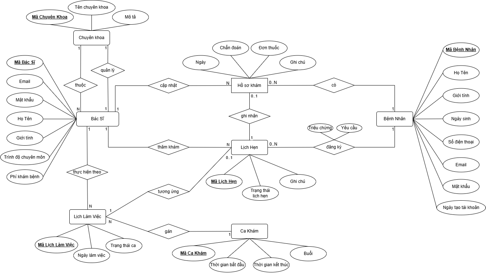

  

---

## 🖼️ DEMO

### 👩‍💼 **Admin Interface**

  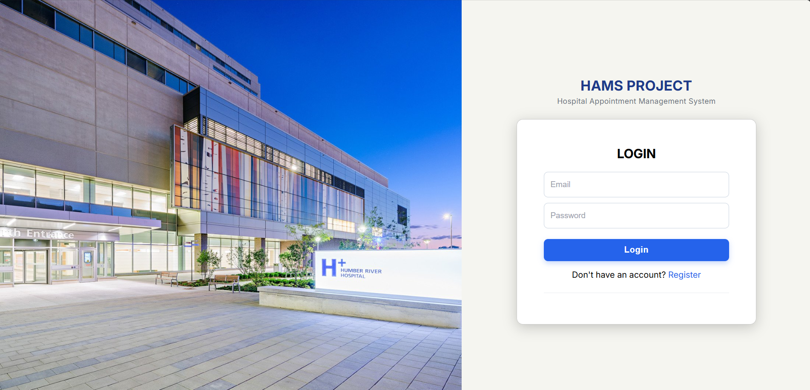
  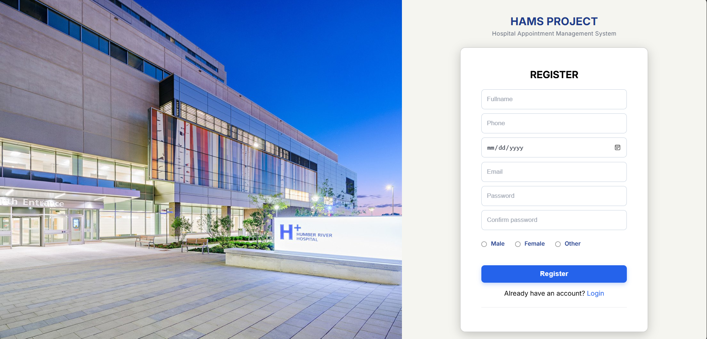

#### 🔹 Step-by-Step

1. **Login / Register**  
   → Access the Admin Dashboard after successful authentication.  
   
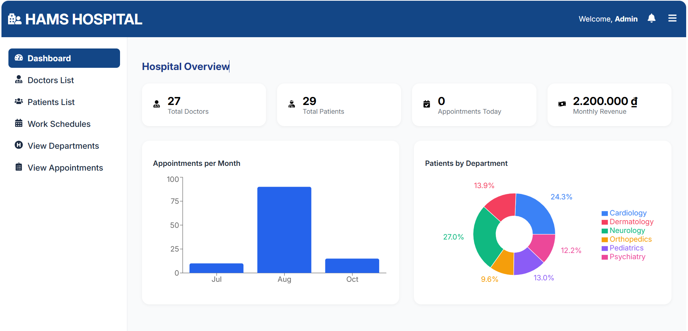

2. **Departments / Specialties**  
   → Add or edit medical departments and assign specialties to doctors.  
   
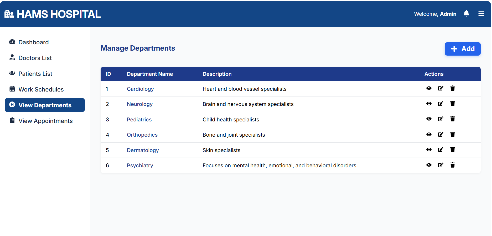

3. **Doctors Management**  
   → Create new doctors, assign specialties, and manage doctor data.  
   

      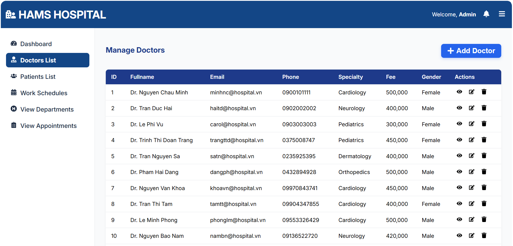
      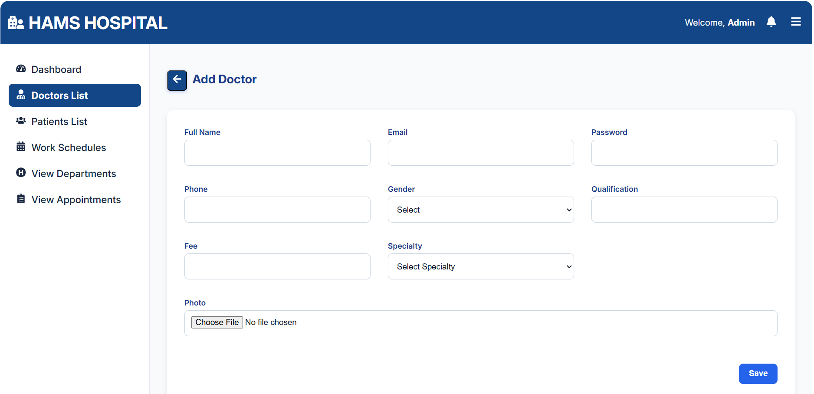
   

4. **Work Schedules**  
   → Define available shifts (start/end time, period) and assign them to doctors.  
   
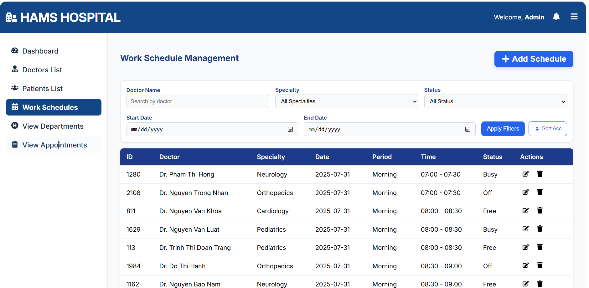

5. **Appointments Overview**  
   → View and filter all appointments by date, doctor, or status.  
   
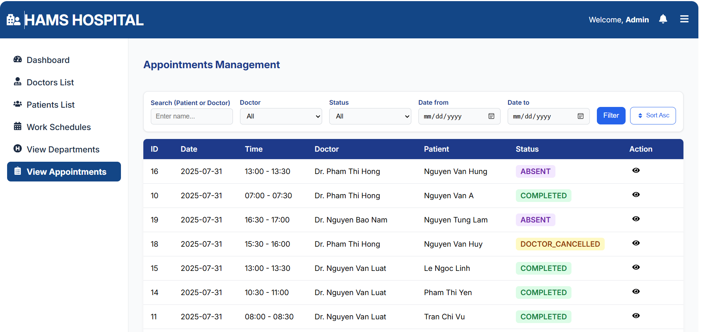

---

### 👨‍⚕️ **Doctor Interface**

  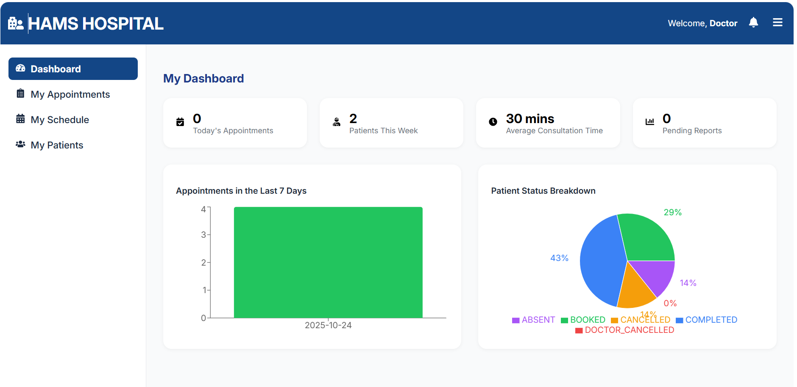

#### 🔹 Step-by-Step

1. **Login as Doctor**  
   → Redirected to the Doctor Dashboard showing today’s appointments.  

2. **View Appointments**  
   → Filter by date or status (*Booked, Completed, Cancelled*).  
   
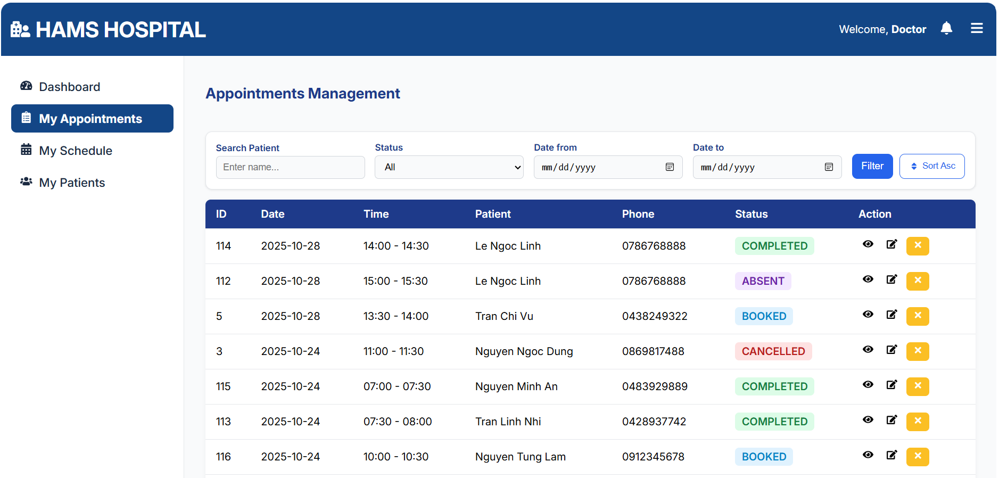

3. **Appointment Details**  
   → Open details to review patient info, symptoms, and requests.  
   
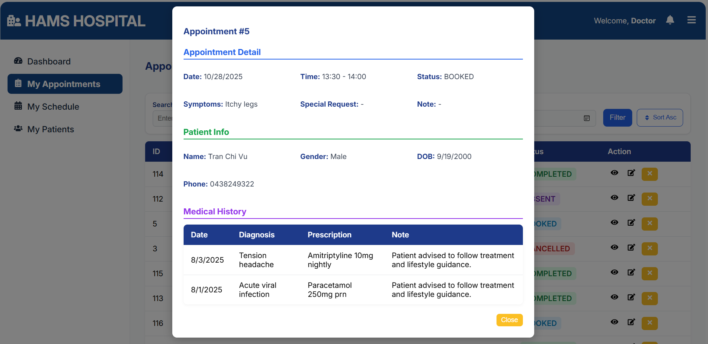

4. **Add Medical Notes**  
   → Input *Diagnosis*, *Doctor Notes*, and *Prescription*.  
   
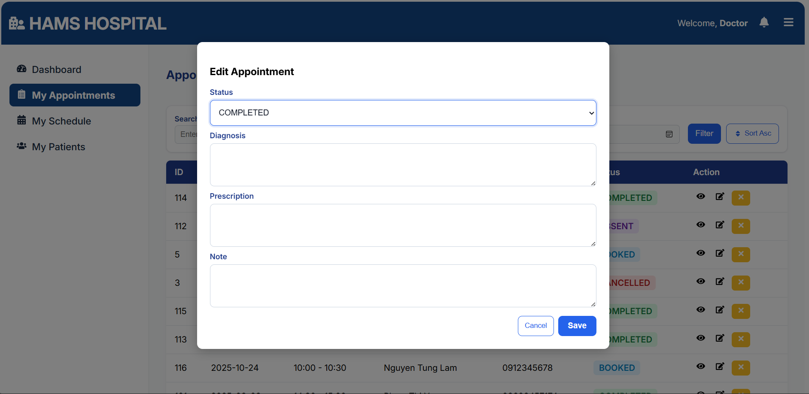

5. **Update Status**  
   → Mark the appointment as *Completed*, *Cancelled*, or *Absent*.  

6. **My Patients**  
   → View the list of all patients the doctor has examined, including detailed medical records and previous diagnoses.  
   

---

### 🧍‍♀️ **Patient Interface**

  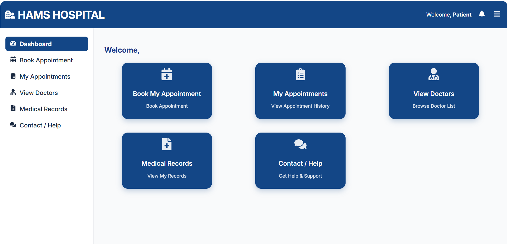

#### 🔹 Step-by-Step

1. **Register / Login as Patient**  
   → Access the patient homepage.  

2. **View Available Doctors**  
   → Filter by department or specialty to see suitable doctors.  
   
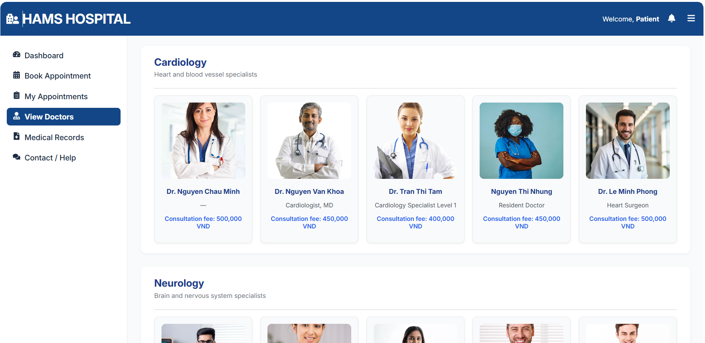

3. **Book an Appointment**  
   → Select doctor → choose date → pick available shift → confirm booking.  
   

4. **My Appointments Page**  
   → View all upcoming and past appointments with current statuses.  
   
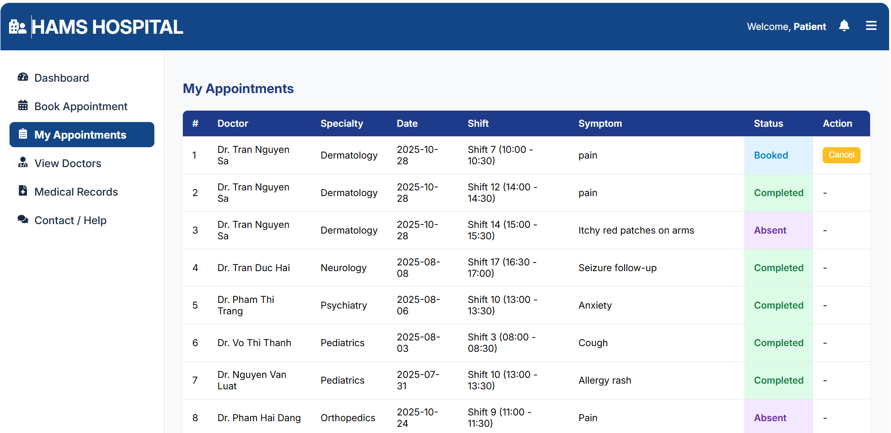

5. **Medical Records**  
   → After consultation, view doctor’s notes, diagnosis, and prescription history.  
   
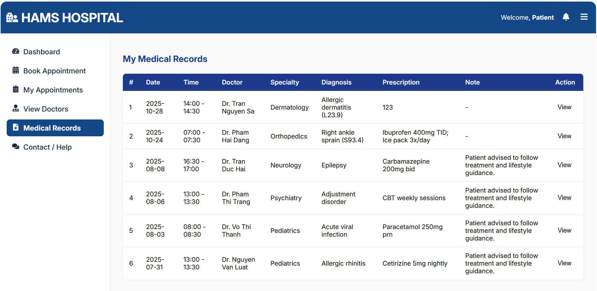

    
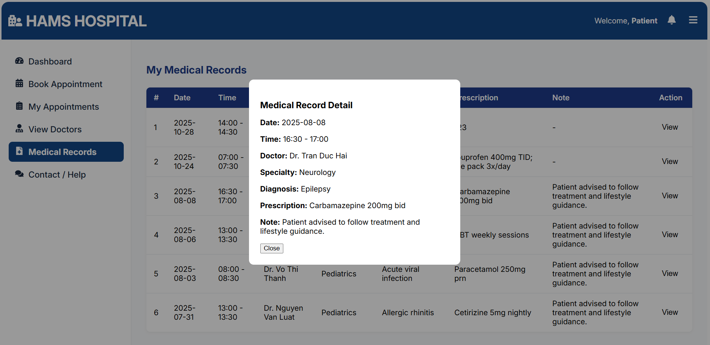

5. **Support & User Guide**  
   
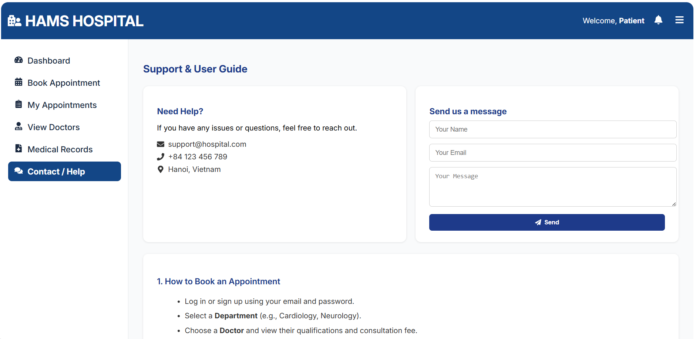

---

## 🚀 Run the Project on Your Machine

### ⚙️ Prerequisites
Before starting, make sure you have installed:
- **Node.js** ≥ 18.x  
- **npm** ≥ 9.x  
- **PostgreSQL** ≥ 14  
- **Git**

---

### 🧱 1. Clone Repository
| Step | Command |
|:-----|:---------|
| Clone the project from GitHub | `git clone https://github.com/your-username/hospital-appointment-management-system.git` |
| Move into the project directory | `cd hospital-appointment-management-system` |

---

### 🗃️ 2. Setup Database (Local PostgreSQL)
| Step | Command |
|:-----|:---------|
| Create a new database in PostgreSQL | `CREATE DATABASE hospitaldb;` |

---

### 🖥️ 3. Backend Setup
| Step | Command |
|:-----|:---------|
| Navigate to backend folder | `cd backend` |
| Install dependencies | `npm install` |
| Create `.env` file and add the following variables |  

| Generate Prisma client | `npx prisma generate` |
| Apply database migrations | `npx prisma migrate dev --name init` |
| (Optional) Insert sample seed data | `npx prisma db seed` |
| Start the backend server | `npm run dev` |

✅ The backend server will run at **http://localhost:5050**

---

### 💻 4. Frontend Setup
| Step | Command |
|:-----|:---------|
| Move to frontend directory | `cd ../frontend` |
| Install dependencies | `npm install` |
| Create `.env` file and add: |  
| Start the frontend server | `npm run dev` |

✅ The frontend server will run at **http://localhost:5173**

---

### 👤 5. Test Accounts (from Seed Data)

| Role | Email | Password |
|:-----|:-------|:----------|
| Admin | admin@example.com | admin123 |
| Doctor | doctor1@example.com | doctor123 |
| Patient | patient1@example.com | patient123 |

Use these accounts to log in and explore the system.

---

### 🧩 6. Build for Production (Optional)
| Step | Command |
|:-----|:---------|
| Build frontend for production | `cd frontend` → `npm run build` → `npm run preview` |
| Build and run backend in production | `cd ../backend` → `npm run build` → `npm start` |

---

### 🧰 7. Common Issues
| Issue | Possible Cause / Solution |
|:------|:---------------------------|
| **Database connection error** | Check the `DATABASE_URL` in your `.env` file and ensure PostgreSQL is running. |
| **Prisma migration fails** | Make sure the database exists before running `npx prisma migrate dev`. |
| **CORS issue in frontend** | Ensure `VITE_API_URL` matches the backend server URL. |
| **Port already in use** | Change backend port in `server.js` or frontend port in `vite.config.js`. |
| **Git push conflicts** | Run `git pull --rebase origin main` before pushing to sync updates. |

---

### ✅ Project Ready!
Open your browser and visit:  
- **Admin Dashboard:** [http://localhost:5173/admin](http://localhost:5173/admin)  
- **Doctor Dashboard:** [http://localhost:5173/doctor](http://localhost:5173/doctor)  
- **Patient Home:** [http://localhost:5173/patient](http://localhost:5173/patient)

